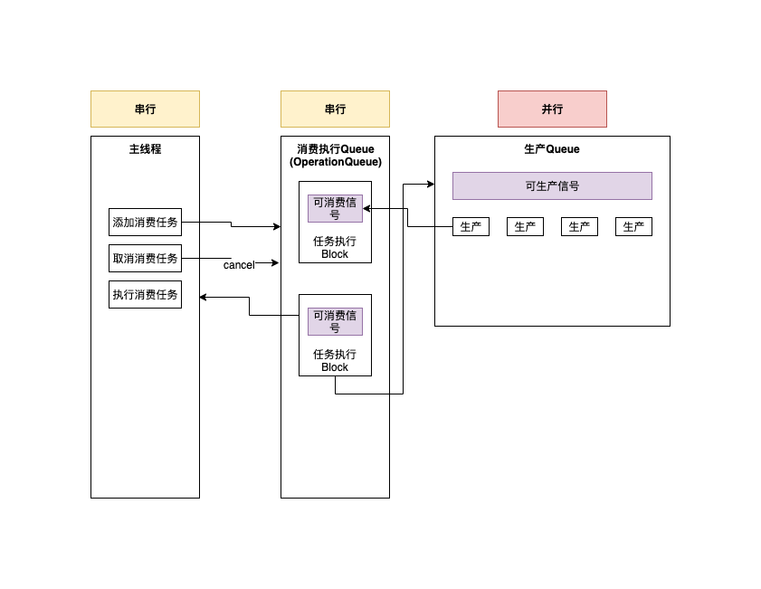

# NutPool

🥜🥜🥜 坚果池子 😀

**NutPool基于异步**✌️✌️✌️

#### 典型的应用场景

生产者: 不断的生产商品

消费者: 不断的消费商品, 如果有. 

在必要的时候还可以取消(例如, 在cell的重用中, 如果cell被重用, 被重用的cell可以取消之前的消费, 放回池子以供新的重用的cell使用)

池子: 就是协调生产中和消费者对商品的生产和消费. 达到平衡. 

#### 示意图

